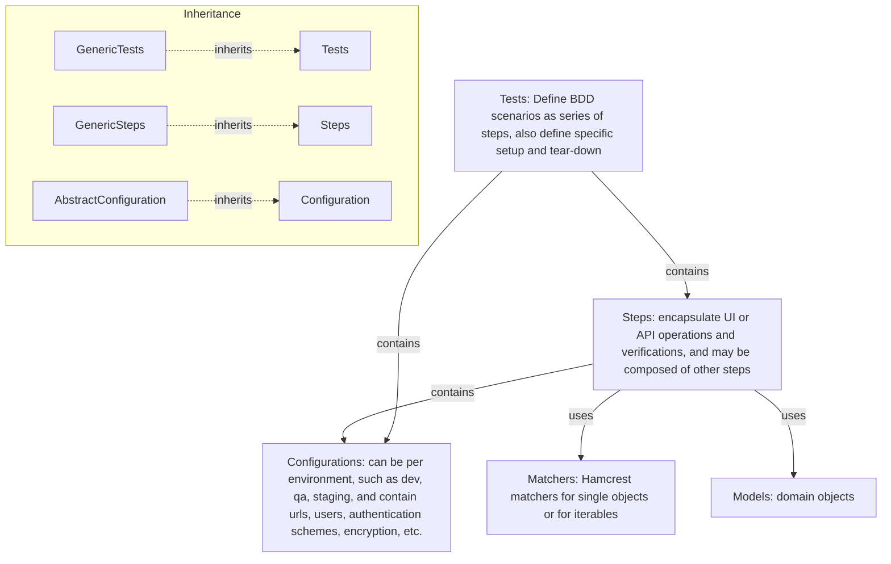

# Python Selenium Example Project

This is a minimal Python test automation project using **Selenium WebDriver** and **pytest**, structured to demonstrate clean, readable test code with a focus on search functionality and API-driven operations.

## Features

- ✅ Easy-to-read step-based test structure
- ✅ Pytest integration for flexible test discovery
- ✅ Selenium WebDriver example with Chrome
- ✅ REST API example
- ✅ GitHub Codespaces-compatible development container

## Architecture



> NOTE: Support for additional technologies, e.g RabbitMQ, can be added by sub-classing these classes and adding specific steps, setup/teardown, and configuration. This allows reusing the basic configuration, reporting, logging, and retrying mechanisms. Further, application tests, steps, and configurations reuse by subclassing from technologies.

## Project Structure

```
python-selenium/
├── .devcontainer/         # Development container setup for Codespaces
├── src/                   # Support code
├── tests/                 # Test cases organized by feature
│   └── test_example.py    # Contains functional tests
├── pyproject.toml         # Project metadata and dependencies
```

## Quick Start (Locally with [PDM](https://pdm-project.org))

> ⚠️ Requires Python 3.13 installed on your system.

1. Install PDM:
   ```bash
   pipx install pdm[all]
   ```

2. Install dependencies:
   ```bash
   pdm install
   ```

3. Run the tests:
   ```bash
   pdm run pytest
   ```

4. Clean PDM state:
    ```bash
    pdm run clean
    ```

## Using in GitHub Codespaces

This repository is fully configured to run in **GitHub Codespaces**:
- Python 3.13
- GitHub CLI

No setup is needed—just open in Codespaces and start coding.

> NOTE: Selenium tests will not work here, unless changed to work with
> SauceLabs, or similar remote browser testing service.

## Reports

1. `report.html` is generated in the root folder; just open it in a browser
2. `allure-results/` is generated for Allure reporting (requires Allure server)

## Example Tests

```python
def should_find(self):
    self.login_section(random.choice(self._configuration.users))
    for word in ["hello", "kitty"]:
        (self.steps
            .when.searching_for(word)
            .then.the_search_hints(
                yields_item(contains_string_ignoring_case(word))))
```

```python
def should_add(self):
    random_pet = SwaggerPetstorePet.random()
    (self.steps
        .when.adding(random_pet)
        .then.the_available_pets(yields_item(is_(random_pet))))
```

## Requirements

- Python 3.13
- Google Chrome
- PDM (Python package manager)

## TODO

- Add GitHub Actions workflow for CI
- Add browser matrix support (Safari, Edge)
- Make the BDD intro words appear in Allure report
- Extend test examples (API + UI)