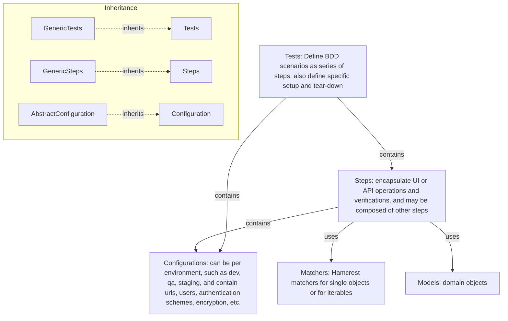

# Python Selenium Example Project

This is a minimal Python test automation project using
[Python QA Automation Starter](https://python.qa-automation-starter.aherscu.dev),
structured to demonstrate clean, readable test code with a focus on search
functionality and API-driven operations.

## Features

- ✅ Easy-to-read step-based (BDD) test structure
- ✅ Pytest integration for flexible test discovery
- ✅ Selenium WebDriver example with Chrome
- ✅ REST API example
- ✅ GitHub Codespaces-compatible development container
-   Allure report in BDD format

## Example Tests

```python
def should_find(self):
    self.login_section(random.choice(self._configuration.users))
    for word in ["hello", "kitty"]:
        (self.steps
            .when.searching_for(word)
            .then.the_search_hints(
                yields_item(contains_string_ignoring_case(word))))
```

```python
def should_add(self):
    random_pet = SwaggerPetstorePet.random()
    (self.steps
        .when.adding(random_pet)
        .then.the_available_pets(yields_item(is_(random_pet))))
```


## Quick Start 
This repository is fully configured to run in **GitHub Codespaces**.

No setup is needed—just open in Codespaces and you will get everything
installed, then open the Tests panel and run a test.

> NOTE: Selenium tests will not work here, unless changed to work with
> SauceLabs, or similar remote browser testing service.

## Running Locally
Requirements:
- Python 3.13 -- <https://www.python.org/downloads/release/python-3130/>
- PDM 2.24 -- <https://pdm-project.org/en/latest/#recommended-installation-method>
- [Optional] Allure 2.25 -- <https://allurereport.org/docs/install/>
- [Optional] Google Chrome -- required for running Selenium tests locally

Following PDM scripts are defined:
- `pdm run install-deps` -- to install/update dependencies
- `pdm run allure-generate` -- to generate Allure dashboard

> NOTE: for other scripts look into [pyproject.toml](pyproject.toml); these are
> also available as tasks in VSCode.

## Reports

1. `report.html` -- in the root folder; just open it in a browser
2. `docs/reports/index.html` -- generated Allure dashboard; open in browseer

## Architecture



> NOTE: Support for additional technologies, e.g RabbitMQ, can be added by sub-classing these classes and adding specific steps, setup/teardown, and configuration. This allows reusing the basic configuration, reporting, logging, and retrying mechanisms. Further, application tests, steps, and configurations reuse by subclassing from technologies. See [Python QA Automation Starter](https://python.qa-automation-starter.aherscu.dev) for more examples and complete documentation.

## Project Structure

```
python-selenium/
├── src/                   # Support code
├── tests/                 # Test cases organized by feature
│   └── test_example.py    # Contains functional tests
├── pyproject.toml         # Project metadata and dependencies
```


## TODO

- Add GitHub Actions workflow for CI
- Add browser matrix support (Safari, Edge)
- Extend test examples (API + UI)